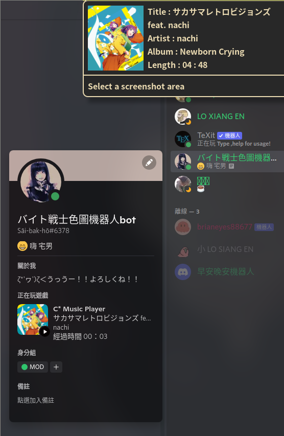

# cmrpc - A Discord RPC for C* Music Player

### with some more features:
- Discord RPC (Albumart as icons!!)
- notify-send when song changes

- to-dos:
	- jp2a visualizer



### About albumart

- For notifier:
	- Extract from mp3 with `ffmpeg`
	- temporarily stored in `~/.config/cmus/covers`(auto create if not exists). 
	- removed when `cmrpc` exits.

- For Discord Rich Presence Icon:
	- Discord RPC can now display images via url
	- Upload the above extracted covers to Imgur

### Requirements
- `ffmpeg`
- `python 3.10` (match-case used) with below packages
```bash
	pip install pyimgur
	pip install pypresence
```

### Usage
- run in background with cmus
	```bash
		/path/to/cmrpc 1>/dev/null & cmus
	```
- `[updated]` better usage:
	```bash
		tmux new -d /path/to/cmrpc; cmus
	```
	- Since `cmrpc` does some clean-ups after `cmus` closed, if the terminal session exits right after `cmus` does, then the clean-ups will be terminated.
